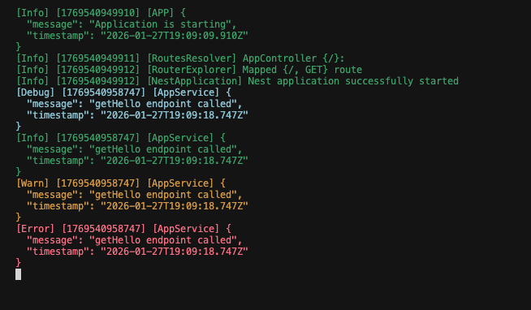

# Eventum
[](https://github.com/dmytroPolhul/eventum/actions/workflows/ci.yml)
[](https://codecov.io/gh/dmytroPolhul/eventum)
[](https://www.npmjs.com/package/eventum)
[](https://www.npmjs.com/package/eventum)

> ⚠️ Eventum is currently in **alpha**.  
> APIs may change, and platform support is still evolving.  
> Prebuilt binaries are currently limited.  
> If you encounter build issues, please open an issue.


**High-performance, low-overhead logger for Node.js apps powered by Rust.**

`Eventum` comes from the Latin *eventus* — “that which has happened”.
In distributed systems, logs are not messages — they are recorded events with consequences.
Eventum is a high-performance logger built to capture those events with minimal overhead.

---

## Why Eventum?

- **Minimal overhead** — Rust handles all heavy lifting with almost no impact on the event loop.
- **Threaded batching** — efficient log batching in background threads.
- **Compact** — no outdated JS dependencies.
- **Text and JSON output formats**.
- **Smart batching** — log millions of messages with ease.
- **Colorized output** (great for CLI debugging).
- **Log rotation**: daily, by size, with backups.
- **Sensitive data masking** — protect passwords, tokens, and PII.
- **NODE_ENV aware** — separate config for dev and prod.

---

## Installation

```bash
npm install eventum
# or
yarn add eventum
```

### Build Requirements

The native module is built automatically during installation. Ensure you have:
- **Node.js** 18.0.0 or higher
- **Rust toolchain** (will be installed via `npm install` if missing)

> Under the hood: compiled Rust binary with no runtime dependencies.

---

## Quick Start

```ts
import * as logger from 'eventum';

// Configure the logger
logger.setConfig({
  prod: {
    output: {
      color: true,
      format: logger.OutputFormat.Json,
      target: logger.OutputTarget.Stderr,
      filePath: './logs/app.log'
    },
    fields: {
      time: true,
      pid: true,
      msg: true,
      level: true
    }
  }
});

// Log at different levels
logger.trace('Detailed trace information');
logger.debug({ userId: '123', action: 'login' });
logger.info('User session started');
logger.warn('Rate limit approaching threshold');
logger.error({ error: 'Connection timeout', retries: 3 });
logger.fatal('Critical system failure');

// Gracefully flush logs before exit
process.on('SIGINT', () => {
  logger.shutdown();
  process.exit(0);
});
```

---

## Colorized Output

Eventum supports colorized output for better readability during development. Each log level is automatically colored:

```ts
logger.setConfig({
  dev: {
    output: {
      format: logger.OutputFormat.Text,
      target: logger.OutputTarget.Stdout,
      color: true  // Enable colorization
    }
  }
});

logger.trace('Trace message');    // Bright black
logger.debug('Debug message');    // Cyan
logger.info('Info message');      // Green
logger.warn('Warning message');   // Yellow
logger.error('Error message');    // Red
logger.fatal('Fatal message');    // Bold red
```



> **Tip**: Colors are automatically disabled when `color: false` or when output is piped to a file.

---

## Benchmark (1 million logs)
> Benchmarks were executed locally on a development machine.
> Results may vary depending on hardware and environment.


| Format | Target  | CPU ms   | Elapsed ms | CPU %   | Memory MB | Logs/sec  |
|--------|---------|----------|------------|---------|-----------|-----------|
| Text   | Stdout  | 3842.29  | 3871       | 99.26%  | 43.20     | 516,662   |
| Text   | Stderr  | 4314.89  | 4330       | 99.65%  | 0.02      | 461,893   |
| Text   | File    | 64694.64 | 64788      | 99.86%  | 0.31      | 30,869    |
| Text   | Null    | 1488.89  | 1489       | 99.99%  | -0.02     | 1,343,183 |
| JSON   | Stdout  | 2656.76  | 2660       | 99.88%  | 0.02      | 751,879   |
| JSON   | Stderr  | 3702.20  | 3709       | 99.82%  | 0.00      | 539,228   |
| JSON   | File    | 62866.59 | 62946      | 99.87%  | -0.02     | 31,773    |
| JSON   | Null    | 1108.02  | 1109       | 99.91%  | -0.03     | 1,803,426 |

> ⚠️ Note: Even with file writing, the logger maintains extremely low overhead.

---

## Sensitive Data Masking

Protect sensitive information in your logs with built-in masking:

```ts
import * as logger from 'eventum';

logger.setConfig({
  prod: {
    output: {
      format: logger.OutputFormat.Json,
      target: logger.OutputTarget.File,
      filePath: './logs/app.log',
      masking: {
        keyword: '***',                              // Replacement text
        exact: ['password', 'token', 'apiKey'],      // Mask these field names
        partial: ['email', 'creditCard'],            // Matches substrings in field names
        regex: ['(?i)bearer\\s+[a-z0-9\\._\\-]+']   // Regex patterns
      }
    }
  }
});

// Sensitive data will be automatically masked
logger.info({
  username: 'alice',
  password: 'secret123',           // Will be masked
  token: 'Bearer abc.def.ghi',     // Will be masked
  email: 'alice@example.com',      // Will be masked (contains 'email')
  userEmail: 'alice@work.com'      // Will be masked (contains 'email')
});

// Output: { username: 'alice', password: '***', token: '***', email: '***', userEmail: '***' }
```

### Masking Options

- **`exact`** — masks values of fields with an exact name match  
  (e.g. `password`, `token`)
- **`partial`** — masks values of fields whose names *contain* any of the given substrings  
  (e.g. `user_email`, `billingEmail`, `creditCardNumber`)
- **`regex`** — masks values matched by custom regex patterns
- **`keyword`** — replacement string (default: `[MASKED]`)

---

## API Reference

### Logging Functions

```ts
logger.trace(message: any): void    // Detailed debug information
logger.debug(message: any): void    // Debug-level messages
logger.info(message: any): void     // Informational messages
logger.warn(message: any): void     // Warning messages
logger.error(message: any): void    // Error messages
logger.fatal(message: any): void    // Critical failures
```

All logging functions accept any type: strings, objects, arrays, or primitives. Complex objects are safely serialized (handles circular references, NaN, BigInt, etc.).

### Configuration

```ts
logger.setConfig(config: LoggerConfig): EnvConfig | null
```

Sets the logger configuration. Returns the active config or `null` if invalid. Automatically selects `dev` or `prod` based on `NODE_ENV`.

### Lifecycle

```ts
logger.shutdown(): void
```

Flushes all buffered logs and cleanly shuts down background threads. Call this before process exit to ensure no logs are lost.

---

<details>
<summary>Types & Enums</summary>

### `LoggerConfig`
```ts
interface LoggerConfig {
  dev?: EnvConfig;
  prod?: EnvConfig;
}
```

### `EnvConfig`
```ts
interface EnvConfig {
  output: OutputConfig;
  fields?: FieldsConfig;
}
```

### `OutputConfig`
- `color: boolean`
- `format: OutputFormat` (Text = 0, Json = 1)
- `target: OutputTarget` (Stdout = 0, Stderr = 1, File = 2, Null = 3)
- `filePath?: string`
- `maxFileSize?: number`
- `maxBackups?: number`
- `rotateDaily?: boolean`
- `batchEnabled?: boolean`
- `batchSize?: number`
- `batchIntervalMs?: number`
- `masking?: MaskingConfig`

### `MaskingConfig`
- `keyword?: string` - Replacement text (default: `[MASKED]`)
- `exact?: string[]` - Field names to mask completely
- `partial?: string[]` - Field names to mask partially
- `regex?: string[]` - Regex patterns to match and mask

### Enums

```ts
enum LogLevel {
  Trace = 0,
  Debug = 1,
  Info = 2,
  Warn = 3,
  Error = 4,
  Fatal = 5
}

enum OutputFormat {
  Text = 0,  // Human-readable text output
  Json = 1   // JSON Lines format (one object per line)
}

enum OutputTarget {
  Stdout = 0,  // Standard output
  Stderr = 1,  // Standard error
  File = 2,    // Log file (requires filePath)
  Null = 3     // Discard logs (useful for benchmarking)
}
```

</details>

---

## Built With

```toml
[dependencies]
napi = { version = "2", features = ["napi6", "serde-json"] }
napi-derive = "2"
once_cell = "1.18"
serde = { version = "1.0", features = ["derive"] }
serde_json = "1.0"
colored = "3.0.0"
chrono = { version = "0.4", features = ["serde"] }
```

---

## License

MIT

---

## Roadmap

- [ ] Async file writing support (currently uses synchronous I/O)
- [ ] Prebuilt binaries for common platforms (npm, arm64, x64)
- [ ] External transport targets (HTTP, sockets, Kafka, etc.)
- [ ] WebAssembly support
- [ ] File compression on rotation

---

## Known Limitations (Alpha)

- **File I/O is synchronous**: File writes may block the event loop on slow disks. Use batching to mitigate.
- **No prebuilt binaries**: Native module builds locally during installation (requires Rust toolchain).
- **Log loss on crash**: Buffered logs are lost if process crashes without calling `shutdown()`.
- **Single config warning**: Logger only warns once if used before `setConfig()`, then silently discards logs.

These limitations will be addressed in future releases.

---

## Best Practices

### Graceful Shutdown

Always call `shutdown()` before process exit to flush buffered logs:

```ts
import * as logger from 'eventum';

// Handle graceful shutdown
process.on('SIGTERM', () => {
  logger.info('Received SIGTERM, shutting down gracefully');
  logger.shutdown();
  process.exit(0);
});

process.on('SIGINT', () => {
  logger.info('Received SIGINT, shutting down gracefully');
  logger.shutdown();
  process.exit(0);
});
```

### Scope-Based Logging

Use the `scope` field to add context to your logs:

```ts
logger.info({ scope: 'AuthService', msg: 'User logged in', userId: '123' });
logger.error({ scope: 'PaymentService', msg: 'Payment failed', orderId: '456' });

// In JSON format, scope appears as a top-level field
// In Text format, scope appears in brackets: [AuthService] User logged in
```

### Environment-Specific Configuration

Configure different behavior for dev and prod:

```ts
logger.setConfig({
  dev: {
    output: {
      format: logger.OutputFormat.Text,
      target: logger.OutputTarget.Stdout,
      color: true  // Colorful output for development
    }
  },
  prod: {
    output: {
      format: logger.OutputFormat.Json,
      target: logger.OutputTarget.File,
      filePath: './logs/app.log',
      batchEnabled: true,
      batchSize: 100,
      batchIntervalMs: 1000
    }
  }
});
```

### Reliability Notes

⚠️ Eventum does not guarantee delivery of in-memory batched logs on process crash. Always call `shutdown()` on graceful exit to flush buffered logs (may block briefly).

---

**Made with 🦀 Rust & ❤️ for performance-first JS developers.**